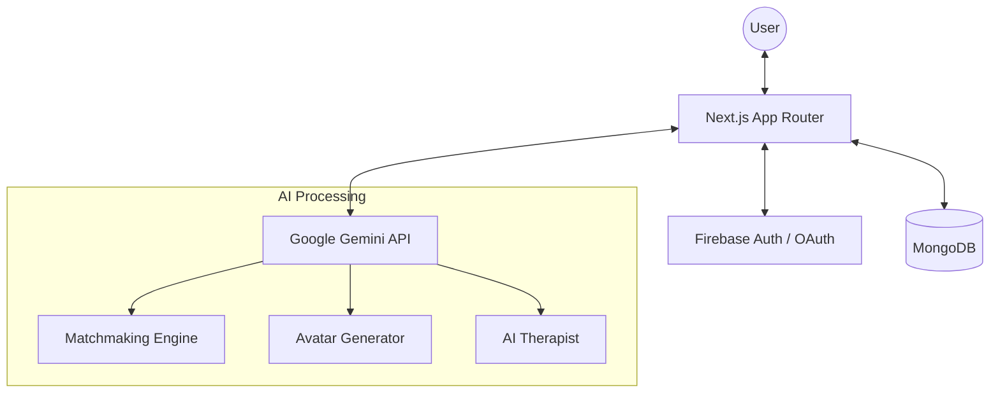

# Obscura


**Solving Solitude, One Connection at a Time.**

Obscura is a privacy-first social platform designed to combat loneliness among students. By leveraging advanced AI-based matching and anonymous communication, we create a safe space for students to discover like-minded peers and build meaningful connections without the pressure of social identity.

---

## ✨ Features

- 🤝 **AI-Powered Matching**: Our unique algorithm uses **Google Gemini** to analyze user personas, interests, and "vibes" to create natural, high-compatibility matches.
- 🎭 **Anonymous Interaction**: Your identity remains hidden until you're ready to share. Discover new people based on personality, not profiles.
- 🧘 **AI Therapy**: An empathetic, professional-grade AI counselor (powered by Gemini) provides a safe, non-judgmental space for students to express their feelings.
- 👤 **Dynamic Avatar Generation**: Auto-generate unique, personality-driven avatars using AI analysis of your profile tags and introduction.
- 🔐 **Seamless Google Auth**: Quick and secure sign-in using Google OAuth.

---

## 🛠️ Tech Stack

Built for the **GDG Hackathon**, showcasing the power of Google Cloud products:

| Component | Technology | Role |
| :--- | :--- | :--- |
| **Frontend** | [Next.js 15+](https://nextjs.org/) | Modern, performant React framework |
| **Styling** | [Tailwind CSS 4](https://tailwindcss.com/) | Utility-first styling for premium design |
| **Database** | [MongoDB](https://www.mongodb.com/) | Flexible NoSQL data storage |
| **Authentication** | [Firebase Auth](https://firebase.google.com/products/auth) | Secure Google OAuth integration |
| **AI / Intelligence** | [Google Gemini API](https://ai.google.dev/) | Matching logic, Avatar gen, and AI Therapy |
| **UI Components** | [Radix UI](https://www.radix-ui.com/) / [Shadcn](https://ui.shadcn.com/) | Accessible, high-quality UI foundations |
| **Animations** | [Framer Motion](https://www.framer.com/motion/) | Smooth, premium micro-animations |

---

## 🏗️ Architecture

The following diagram illustrates the high-level architecture of Obscura:



### Matchmaking Workflow
1. **Base Scoring**: Filters candidates by location, language, and shared tags.
2. **AI Layer**: Gemini analyzes user "introductions" vs "preferences" to assign a compatibility score.
3. **Randomization**: Adds a natural variability element to the top-tier candidates.
4. **Execution**: Creates a secure, ephemeral chat room for the matched pair.

---

## 🚀 Self-Hosting Guide

Want to run Obscura on your own? Follow these steps:

### 1. Prerequisites
- Node.js 20+
- [pnpm](https://pnpm.io/) installed
- A [MongoDB Atlas](https://www.mongodb.com/cloud/atlas) cluster
- A [Google AI Studio](https://aistudio.google.com/) API Key for Gemini
- A [Firebase Project](https://console.firebase.google.com/) for Authentication

### 2. Environment Setup
Create a `.env.local` file in the `code` directory with the following variables:

```env
# MongoDB
MONGODB_URI=your_mongodb_connection_string

# Firebase (Client & Admin)
NEXT_PUBLIC_FIREBASE_API_KEY=...
NEXT_PUBLIC_FIREBASE_AUTH_DOMAIN=...
NEXT_PUBLIC_FIREBASE_PROJECT_ID=...
FIREBASE_PROJECT_ID=...
FIREBASE_CLIENT_EMAIL=...
FIREBASE_PRIVATE_KEY=...

# Gemini
GEMINI_API_KEY=your_gemini_api_key
```

### 3. Installation & Run
```bash
# Navigate to code directory
cd code

# Install dependencies
pnpm install

# Start development server
pnpm dev
```

---

## 👨‍💻 Credits

Obscura was built with ❤️ by the **Syntax Error** team:
- **Debyte**
- **Shams**
- **Astitva**
